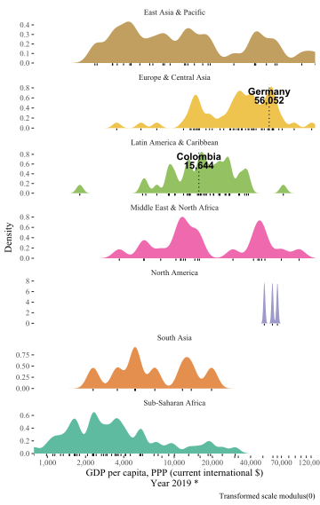
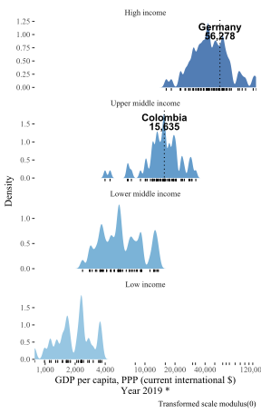
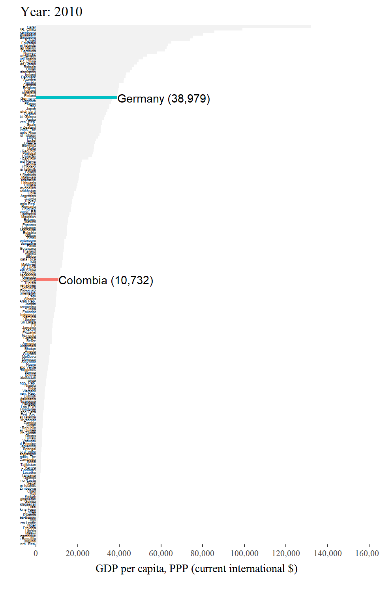
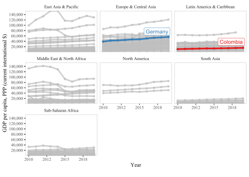

<!-- README.md is generated from README.Rmd. Please edit that file -->

# wdiquickplots

<!-- badges: start -->

<!-- badges: end -->

The goal of `wdiquickplots` is to provide, well, quick plots for World
Development Indicators (WDI, [“the primary World Bank collection of
development indicators, compiled from officially recognized
international sources.”](https://databank.worldbank.org/home.aspx)). To
get WDI data, this package is powered by
[`WDI`](http://vincentarelbundock.github.io/WDI/) package, developed by
Vincent Arel-Bundock.

## Installation

You can install it from this Github repo with:

``` r
remotes::install_github("edalfon/wdiquickplots")
```

## Examples

Use case: hey I have to present this study I have been working on in my
home country to an audience where I currently live (studying abroad or
whatever). Thus, some background data on my home country is in order. A
table would certainly do, but it is boring. So let’s put some plots in
there.

``` r
library(wdiquickplots)
plot_dist_wdi_ind("NY.GDP.PCAP.PP.CD", p = 0)
```



There you go. That’s the spirit of this package. One line of code and
bang\!, a relatively decent plot that you can put in your slides to
convey a quick message.

Using this package goes as follows:

  - Find the code of the indicator of interest. You can use
    `WDI::WDIsearch` for this, but I actually find it a bit more
    user-friendly to simply go to the [indicators page
    (https://data.worldbank.org/indicator)](https://data.worldbank.org/indicator)
    and get the code from there (it’s in the URL).
  - You pass the indicator code as the first argument of the different
    plotting functions in this package.
  - As second argument, you pass the countries you want to highlight.

And there you go. Below you can see examples, but in general, the plots
in this package quickly show:

  - Where the highlighted countries stand in terms of the indicator of
    interest.
  - How do they compare among highlighted countries, and against the
    rest of the world, regions or income groups.
  - What have been the changes in time.

You can read other details and description of features in the `pkgdown`
site for this little package (I know, a `pkgdown` site may be overkill,
but anyway).

# Distribution

A plot to quickly compare highlighted countries, among them, and with
the rest of the world using either regions or income, to group
countries.

``` r
plot_dist_wdi_ind("NY.GDP.PCAP.PP.CD", facets = income, p = 0)
```



# Bar plot

Similar as the distribution plot, quickly shows where the highlighted
countries stand in comparison with the rest of the world (without using
any country groups). This one is interactive so you can explore a bit
(e.g. zooming in and out or see the exact value of the indicator for
each country as tooltip).

``` r
wdiquickplots::plot_bar_wdi_ind("NY.GDP.PCAP.PP.CD")
```

<!--html_preserve-->

<iframe src="man/figures/README-barplot-1.html" width="70%" height="600" scrolling="no" seamless="seamless" frameBorder="0" style="display: block; margin: auto;">

</iframe>

<!--/html_preserve-->

# Race bar plot

Takes the same approach as the bar plot above, but showing also how it
changes over time (powered by `gganimate`).

``` r
wdiquickplots::plot_race_wdi_ind("NY.GDP.PCAP.PP.CD")
#> WDI: 0 sec elapsed
```



# Line plot

Well, a line plot including only data from the highlighted countries. It
shows directly the first and last value for each country and labels the
series directly (it is an interactive plot as well).

``` r
wdiquickplots::plot_time_wdi_ind("NY.GDP.PCAP.PP.CD")
```

<!--html_preserve-->

<iframe src="man/figures/README-lineplot-1.html" width="70%" height="600" scrolling="no" seamless="seamless" frameBorder="0" style="display: block; margin: auto;">

</iframe>

<!--/html_preserve-->

# Facetted line plot

Also a line plot as above, but including data for all countries. It is
powered by `gghighlight` to disentangle the spaghetti plot.

``` r
wdiquickplots::plot_time_facets_wdi_ind("NY.GDP.PCAP.PP.CD")
```



# Spaghetti plot

No one should ever see or want to see a spaghetti plot with so many
series. Yet, here’s one. 🙈.

Just have fun playing with it. The interactivity (powered by `dygraphs`)
highlights one series at a time, and sometimes (very rarely, but
sometimes), can make such a spaghetti plot useful to identify
eye-catching patterns.

``` r
wdiquickplots::plot_spaghetti_wdi_ind("NY.GDP.PCAP.PP.CD")
```

<!--html_preserve-->

<iframe src="man/figures/README-spaghetti-1.html" width="70%" height="600" scrolling="no" seamless="seamless" frameBorder="0" style="display: block; margin: auto;">

</iframe>

<!--/html_preserve-->
