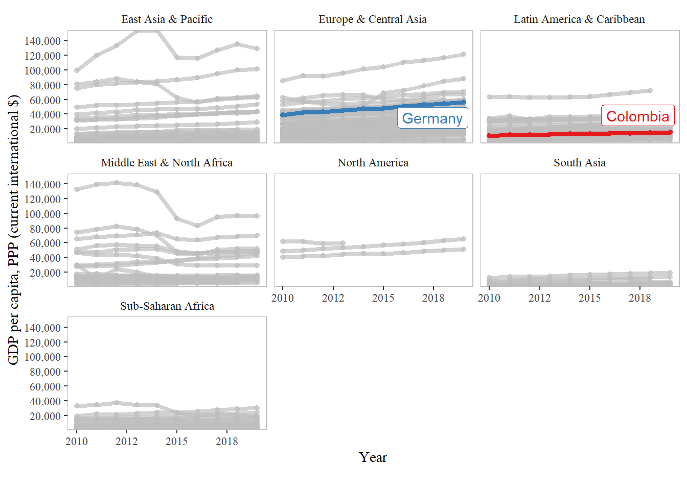

<!-- README.md is generated from README.Rmd. Please edit that file -->

# wdiquickplots

<!-- badges: start -->

<!-- badges: end -->

The goal of `wdiquickplots` is to provide, well, quick plots for World
Development Indicators (WDI, [“the primary World Bank collection of
development indicators, compiled from officially recognized
international sources.”](https://databank.worldbank.org/home.aspx)). To
get WDI data, this package is powered by
[`WDI`](http://vincentarelbundock.github.io/WDI/) package, developed by
Vincent Arel-Bundock.

## Installation

You can install it from this Github repo with:

``` r
remotes::install_github("edalfon/wdiquickplots")
```

## Examples

Use case: hey I have to present this study I have been working on in my
home country to an audience where I currently live (studying abroad or
whatever). Thus, some background data on my home country is in order. A
table would certainly do, but it is boring. So let’s put some plots in
there.

``` r
library(wdiquickplots)
plot_dist_wdi_ind("NY.GDP.PCAP.PP.CD", p = 0)
```


There you go. That’s the spirit of this package. One line of code and
bang\!, a relatively decent plot that you can put in your slides to
convey a quick message.

Below you can see other examples, but in general, this package goes as
follows:

  - Find the code of the indicator of interest. You can use
    `WDI::WDIsearch` for this, but I actually find it a bit more
    user-friendly to simply go to the [indicators page
    (https://data.worldbank.org/indicator)](https://data.worldbank.org/indicator)
    and get the code from there (it’s in the URL).
  - You pass the indicator code as the first argument of the different
    plotting functions in this package.
  - As second argument, you pass the countries you want to highlight.

And there you go. Below you can see other examples, but in general, the
plots in this package quickly show:

  - Where the highlighted countries stand in therms of the indicator of
    interest.
  - How do they compare among highlighted countries, and agains the rest
    of the world, regions or income groups.
  - What have been the changes in time.

You can read other details and description of features in the pkgdown
site for this little package (I know, a pkgdown site may be overkill,
but anyway).

``` r
wdiquickplots::plot_bar_wdi_ind("NY.GDP.PCAP.PP.CD")
```

<!--html_preserve-->

<iframe src="C:\E\MEGA\R\wdiquickplots\man\figures\README-barplot.html" width="70%" height="600" scrolling="no" seamless="seamless" frameBorder="0">

</iframe>

<!--/html_preserve-->

``` r
wdiquickplots::plot_race_wdi_ind("NY.GDP.PCAP.PP.CD")
```


``` r
wdiquickplots::plot_time_wdi_ind("NY.GDP.PCAP.PP.CD")
```

<!--html_preserve-->

<iframe src="C:\E\MEGA\R\wdiquickplots\man\figures\README-lineplot.html" width="70%" height="600" scrolling="no" seamless="seamless" frameBorder="0">

</iframe>

<!--/html_preserve-->

``` r
wdiquickplots::plot_time_facets_wdi_ind("NY.GDP.PCAP.PP.CD")
```



``` r
wdiquickplots::plot_time_wdi_ind("NY.GDP.PCAP.PP.CD")
```

<!--html_preserve-->

<iframe src="C:\E\MEGA\R\wdiquickplots\man\figures\README-spaghetti.html" width="70%" height="600" scrolling="no" seamless="seamless" frameBorder="0">

</iframe>

<!--/html_preserve-->
